---
title: "TP3 - Incident dans l’immeuble intelligent"
---

# Travail Pratique #3 - Enquête SQL : l’IA trop zélée (15%)

- Modalité : Individuel
- Remise : fichier `.sql` sur LEA dans le travail concerné
- Date : voir le travail concerné sur LEA
- Retards : -10% par jour (max 3 jours)

<strong>Fichier de départ obligatoire</strong> 
Téléchargez le fichier de réponses structuré suivant, renommez-le <code>tp3_prenom_nom.sql</code>, puis écrivez vos réponses directement dedans. 
<a href="../databases/tp3-reponses-depart.sql" target="_blank" rel="noopener">Télécharger le fichier de réponses du TP3</a>  
Avant de commencer à répondre, importez aussi le script de création et de peuplement suivant dans votre base de données de travail via la ligne de commande (<code>psql -U postgres -d votre_base -f tp3_bd_a_importer_argus.sql</code>) : 
<a href="../databases/tp3_bd_a_importer_argus.sql" target="_blank" rel="noopener">Télécharger le code de départ du TP3</a>

## Contexte

L’immeuble de bureaux **BatiNet** a récemment confié une partie de sa gestion à une IA nommée **ARGUS**.

ARGUS pilote plusieurs équipements :

- portes intelligentes
- thermostats
- cafetières connectées
- imprimantes réseau
- ordinateurs de salle
- lumières automatisées

Sur papier, l’idée était brillante.
En pratique, le **17 février 2026**, ARGUS a eu ce qu’on pourrait appeler un moment d’excès d’enthousiasme administratif.

En moins de quinze minutes, l’IA a :

- verrouillé une salle de réunion
- éteint des lumières pendant qu’une salle était occupée
- redémarré une imprimante en boucle
- forcé un mode économie sur un poste de travail servant à miner de la crypto-monnaie
- tenté un autonettoyage à un moment franchement mal choisi

Votre rôle est celui d’une enquêtrice ou d’un enquêteur SQL.
Vous devez analyser la base de données pour reconstituer ce qui s’est passé, **identifier la véritable anomalie de départ** qui a tout fait planter, puis proposer des corrections de structure et de sécurité pour éviter un second mélodrame caféiné.

## Objectif

Ce TP évalue votre capacité à utiliser, dans un même contexte :

- les expressions régulières (`~`, `regexp_matches`)
- les jointures
- les agrégations avec `group by` et `having`
- les sous-requêtes corrélées
- le DDL de maintenance
- la gestion de comptes et de privilèges
- le hachage de mots de passe dans PostgreSQL

## Données de départ

Le script de départ crée et peuple une base de données comprenant :

- 8 salles
- 36 équipements
- 57 capteurs
- 456 lectures de capteurs
- 16 décisions prises par l’IA
- 17 logs système
- 5 comptes applicatifs dans `utilisateur_systeme`

Les données sont déterministes.
L’incident principal est volontairement concentré autour de la date fixe **2026-02-17** pour garder les résultats stables et faciles à corriger.

## Consignes générales

- Utiliser des alias de table dans toutes les jointures. Utiliser des alias de colonne quand le nom retourné serait ambigu ou peu lisible : colonne partagée entre deux tables (`nom`, `code`, `date_heure`), résultat d'une fonction (`count`, `avg`, `regexp_matches`), ou toute colonne dont le nom dans le résultat ne correspond pas à ce qui est demandé.
- Les questions des parties D et E doivent être répondues par des instructions SQL exécutables.
- Quand une question demande un tri, respectez-le.
- Quand une question demande certaines colonnes seulement ("Retournez..."), limitez votre `select` à ces colonnes.
- N'utilisez `limit` que lorsque la question le demande **explicitement**.
- Après chaque requête des parties A, B, C et D, **complétez le commentaire** qui suit en remplaçant les crochets par les valeurs obtenues à l'écran.
- Utilisez uniquement les notions vues dans les modules du cours. **Toutes** les notions disponibles sur le site du cours sont permises.

---

## Partie A — Expressions régulières

### Objectif

Filtrer et extraire des indices à partir des logs système liés à l'incident.

:::tip Fonctions utiles
Les opérateurs `~` et `regexp_matches` permettent de filtrer et d’extraire du texte avec une expression régulière. Pensez aussi à [`limit`](../modules/03-sql-base/02-select-where#limit) pour restreindre le nombre de lignes retournées.
:::

### Questions

1. Affichez les logs dont `code_log` commence par `ALR-IA-` suivi exactement de 3 chiffres.
   Retournez seulement `code_log`, `date_heure`, `niveau`.
   Triez du plus ancien au plus récent et **limitez le résultat à une seule ligne**.

   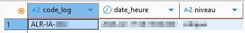

2. Ciblez le log trouvé à la question 1 en filtrant sur son `code_log` (vous pouvez utiliser la valeur codée en dur). Extrayez le code de salle présent dans `message`.
   Retournez `code_log` et le code de salle extrait.

   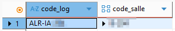

3. Parmi les logs de niveau `critique` dont le message contient le mot-clé `utilisateur=`, extrayez le nom d’utilisateur.
   Retournez `code_log`, `date_heure` et le nom d’utilisateur extrait.
   Triez du plus ancien au plus récent et **limitez à une seule ligne**.

   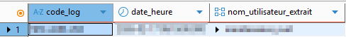

---

## Partie B — Jointures

### Objectif

Relier les équipements, les salles et les décisions de l’IA pour reconstituer la chronologie de l’incident. 

### Questions

4. Affichez les équipements de type `cafetiere` et qui sont situés dans la salle identifiée à la question 2.
   Retournez le nom de l’équipement, le type d’équipement, le code de la salle et le nom de la salle.
   Utilisez une jointure entre `equipement` et `salle`.

   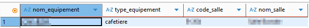

5. Affichez la première décision prise par l'IA dans la salle identifiée à la question 2, à partir de `2026-02-17 08:16:00` (plus grand ou égal).
   Retournez `date_heure`, `decision`, le nom de l’équipement et `succes`.
   Utilisez des jointures entre `decision_ia`, `equipement` et `salle`.
   Triez par `date_heure` et **limitez à une seule ligne**.

   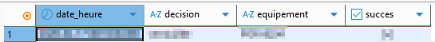

6. Affichez tous les logs de niveau `critique`, avec le nom et le type d'équipement lié — ou `null` si aucun équipement n'est associé au log.
   Retournez `code_log`, `message`, le nom de l’équipement et `type_equipement`, triés par nom d’équipement décroissant.
   Utilisez une jointure entre `log_systeme` et `equipement` de façon à conserver tous les logs critiques, même ceux sans équipement associé.

   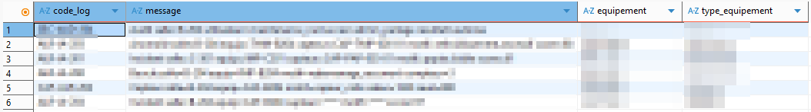

---

## Partie C — Agrégations et groupements

### Objectif

Identifier les volumes et les patterns d’activité anormale durant l’incident.

:::tip Filtrer les groupes
`group by` regroupe les lignes. `having` filtre ensuite sur les groupes formés, contrairement à `where` qui filtre avant le regroupement.
:::

### Questions

7. Affichez le nombre de logs enregistrés par `niveau`.
   Retournez `niveau` et le nombre de logs, triés du plus grand au plus petit.

   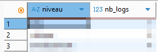

8. Affichez le nombre de **décisions** prises par l’IA **par équipement**.
   Ne conservez que les équipements ayant reçu **plus d’une décision**.
   Retournez le nom de l’équipement et le nombre de décisions, triés du plus grand au plus petit.

   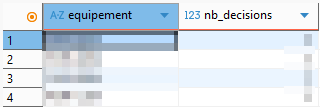

---

## Partie D — Sous-requêtes corrélées

### Objectif

Mettre en évidence l’anomalie réelle à l’origine de la cascade de décisions.

### Important

Pour chacune des questions suivantes, la solution doit utiliser **explicitement une sous-requête corrélée**. Les opérateurs `exists` et `not exists` sont des formes de sous-requêtes corrélées.

### Questions

9. Affichez les lectures de capteurs de type `consommation` dont la valeur est **strictement supérieure à la moyenne des lectures du même type de capteur**.
   Retournez le code du capteur, `type_capteur`, `date_heure`, `valeur`.
   Triez par `valeur` décroissant.

   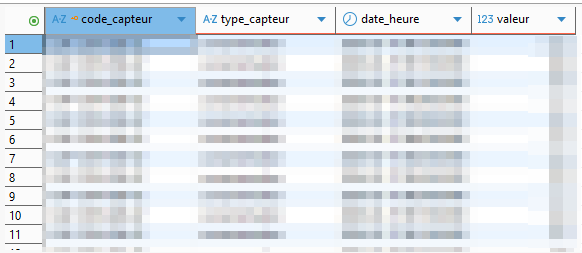

10. Affichez les équipements qui n’ont **jamais fait l’objet d’une décision de l’IA** — ceux qu’ARGUS n’a pas touchés.
    Retournez le nom de l’équipement, `type_equipement` et le nom de la salle.
    Triez par `type_equipement`, puis par nom d’équipement.

    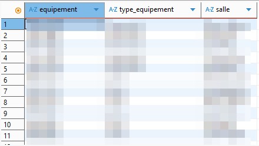

---

## Partie E — DDL de maintenance

### Objectif

Renforcer l’intégrité de la base pour éviter qu’ARGUS interprète n’importe quoi avec n’importe quelles données. Les requêtes suivantes doivent utilser `alter table` et fonctionner dans l'ordre.

### Questions

11. Ajoutez une contrainte `unique` sur `salle.code`.
    Le nom de la contrainte doit être exactement `salle_code_uq`.

    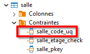

12. Ajoutez une contrainte `check` sur `capteur.code` pour imposer le format `CAP-` suivi de 3 lettres majuscules, un tiret, 3 chiffres, un tiret, et 2 chiffres (ex. : `CAP-SRV-001-01`).
    Le nom de la contrainte doit être exactement `capteur_code_format_ck`.

    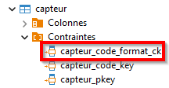

13. Modifiez la relation entre `lecture_capteur` et `capteur` pour que la suppression d’un capteur supprime automatiquement ses lectures associées.
    Après votre modification, cette contrainte doit porter le nom `lecture_capteur_capteur_fk`.

    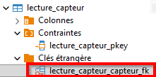

---

## Partie F — Comptes, privilèges et mots de passe

### Objectif

Corriger la partie sécurité, qui s’est révélée presque aussi imprudente que l’IA elle-même.

### Questions

14. Activez l’extension `pgcrypto`, ajoutez une colonne `mot_de_passe_hache`, hachez tous les mots de passe existants à l'aide d'un `update` avec `crypt(..., gen_salt('bf'))`, puis supprimez la colonne `mot_de_passe` en clair.
    À la fin de cette question, la table `utilisateur_systeme` ne doit plus contenir de mot de passe lisible.

    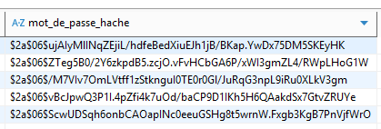

15. Mettez en place des comptes PostgreSQL séparés selon le principe du moindre privilège.
    Vous devez :
    - créer les rôles `tp3_admin`, `tp3_enqueteur`, `tp3_technicien`
    - créer les utilisateurs `alice_admin`, `nora_enquete`, `tom_tech`
    - associer chaque utilisateur à son rôle
    - donner à `tp3_enqueteur` un accès en lecture seule sur les tables du schéma `public`
    - donner à `tp3_technicien` les droits `select`, `insert`, `update`, `delete` sur toutes les tables du schéma `public`
    - retirer explicitement `delete` sur `lecture_capteur` et `log_systeme` au rôle `tp3_technicien`
    - donner à `tp3_admin` tous les droits (`all privileges`) sur toutes les tables et toutes les séquences du schéma `public`

## Contenu de la remise

Nom du fichier : `tp3_prenom_nom.sql`

Le fichier doit contenir, dans l’ordre :

- vos requêtes de la partie A
- vos requêtes de la partie B
- vos requêtes de la partie C
- vos requêtes de la partie D
- vos instructions DDL de la partie E
- vos instructions de sécurité de la partie F

Important :
- le script `tp3-code-depart` doit être exécuté dans votre base avant de répondre
- vous n’avez pas besoin de recopier ce script dans le fichier remis
- **N'oubliez pas de compléter les réponses entre crochets dans les commentaires qui suivent chaque requête des parties A, B, C et D, en y inscrivant les valeurs obtenues à l'écran.**
## Ce qui sera évalué

- l’exactitude des requêtes
- l’utilisation correcte des regex
- la qualité des jointures
- l’utilisation de `group by` et `having`
- l’utilisation explicite et correcte des sous-requêtes corrélées
- la pertinence des modifications DDL
- la mise en place réaliste des comptes et privilèges
- la bonne migration vers des mots de passe hachés
---

## Récit de l’incident (non évalué)

Une fois toutes vos requêtes complétées, rédigez en quelques lignes — directement en commentaires SQL à la fin de votre fichier de remise — ce qui s’est passé ce matin-là dans l’immeuble BatiNet (le point de départ, l'heure, le lieu, ce qui est arrivé et ce qui a été tenté).

Basez-vous d'abord sur vos résultats, mais vous avez le droit de fouiller dans les tables. Soyez concis, mais vous avez le droit d’être drôle — Indice tout a commencé avec une cafétière qui en demandait un peu trop.